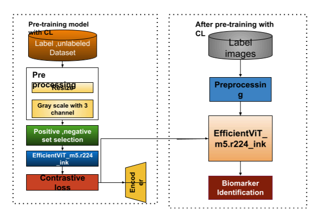

# ENHANCING OPHTHALMIC BIOMARKER DETECTION: ACTIVE LEARNING STRATEGIES AND EXPLAINABLE AI FOR RADIOLOGICAL INTERPRETATION

ABSTRACT: Ophthalmic diseases are pervasive, and Optical Coherence Tomography (OCT) scanning plays a pivotal role in their diagnosis. Traditionally, experts have relied on manual identification of diseases and biomarkers from OCT scans. Recently, contemporary medical imaging practices increasingly leverage deep learning techniques to expedite and enhance diagnostic precision in ophthalmology. Within the realm of medical imaging, acquisition of datasets with accurately labeled data presents a significant challenge, primarily due to the expertise required for meticulous annotation by trained professionals. This article introduces a novel two-stage training strategy aimed at enhancing the identification of ophthalmic biomarkers utilizing OCT scans from the OLIVES dataset, which comprised only 12% labeled data. Our approach capitalizes on a robust methodology that effectively harnesses both labeled and unlabeled data, thereby improving biomarker identification accuracy. We employed active learning to leverage the unlabeled data, enhancing the identification of each biomarker through ensembling models based on their respective performance within each setup. Additionally, to pinpoint regions of interest harboring relevant biomarkers, we utilized Gradient-weighted Class Activation Mapping (GradCAM) for interpretability, with the aim of assisting experts in the identification process.

Following are the main contribution of our work:
- We introduce a two-stage training approach utilizing active learning to effectively leverage both labeled and unlabeled 
data.
- We assembled each model with the best outcome for each particular biomarker for an effective result handling each 
biomarker individually for increasing overall precision.
- Demonstrating how the application of active learning strategies, coupled with an efficient filtering system, to optimize 
the biomarker discovery process within a multi-label classification context.
- The integration of GradCAM provides a valuable contribution by offering insights into the model's decision-making 
process. This enhances the interpretability of the biomarker identification results, fostering a better understanding of 
the underlying biological significance.

# Contrastive Learning Approaches for Ophthalmic Biomarker Identification: Unveiling Insights into Eye Health

ABSTRACT: The field of ophthalmic biomarker identification plays a pivotal role in understanding and
monitoring eye health. In this study, I leverage the EfficientViT_m5.r224_inlk model as
our foundational framework to explore constructive learning approaches for enhancing
biomarker identification accuracy. Initially, the model achieved a baseline accuracy of
69%. However, through the integration of contrastive learning techniques, a significant
improvement, achieving an accuracy of 73%.The contrastive learning is used on multilabel classes of images with different approaches.I introduce a nobel contrastive learning
on label and unlabeled data for pre-train a model in this study.This research delves into the
methodologies of constructive learning, shedding light on how these approaches contribute
to the identification of key biomarkers related to eye health. The incorporation of
contrastive learning has proven to be particularly effective, unveiling insights that go
beyond the capabilities of traditional models. The findings underscore the importance of
leveraging advanced learning techniques in ophthalmic biomarker identification, providing
a more nuanced understanding of eye health. As precision in biomarker identification is
crucial for early detection and intervention in ocular diseases, my study contributes to the
ongoing efforts aimed at improving diagnostic capabilities in the realm of ophthalmology
and applying contrastive learning on multi-label classes with different from traditional
approaches.The successful application of contrastive learning not only enhances accuracy
but also opens avenues for further exploration and refinement of ophthalmic biomarker
identification methodologies.

The following contributions are:

- Proposed a novel contrastive learning approach using feature vectors
- Utilized a large amount of unlabeled data
- Unveiled different types of contrastive learning approaches